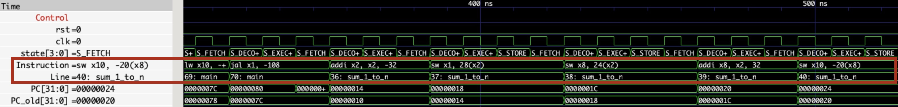

# Assembler/Linker

For my final project, I set out to be able to close the loop of compiling a C program to RISC-V and running it on the CPU. This was successful, and currently works for simple C programs--however the assembler/linker doesn't yet support more complex programs.

**Currently Supported:**
- [x] All pseudo-instructions (from [this source][pseudoinstructions], not including operations our CPU doesn't support like floats)
- [x] Various number literals for immediate values (including `imm(reg)` and `reg, imm` notation): `0xFF`, `0b1010`, `0100` (octal, leading zero), `1234` (decimal). 
- [x] Compiling simple C programs to `rv32i` assembly with GCC
- [x] Parsing basic GCC assembly and assembling it
- [x] Function calls, including recursive ones
- [x] Proper initialization of the CPU at startup ([`asm/_preamble.s`](../asm/_preamble.s))
	- [x] Set the stack pointer (`sp`) to the top of data memory
	- [x] Properly `call main`, so that returning from main works
	- [x] `halt` after main returns

## Quick Start

**TL;DR:** Put your C program in `csrc/<whatever>.c`. It should have an `int main(int argv)` like any good C program. Run `make test_rv32i_c_<whatever> ARGV=10`. See `csrc/fibonacci.c`/`make test_rv32i_c_fibonacci ARGV=10` for an example.

Let's say we want to calculate the sum of all numbers from 1 to n (inclusive) for some n. Here's that in C:

```c
int sum_1_to_n(int n)
{
	if (n <= 0) return 0;
	return n + sum_1_to_n(n);
}
```

Of course, no C program is complete without a `main()` entrypoint, so let's add that and put our program in `csrc/sum_1_to_n.c`:

```c
// csrc/sum_1_to_n.c

int sum_1_to_n(int n)
{
	if (n <= 0) return 0;
	return n + sum_1_to_n(n - 1);
}

int main(int argv)
{
	return sum_1_to_n(argv);
}
```

Note that `main` takes an integer and returns one.[^main-sig] These are both optional, but if present the argument can be set from the command line with the `ARGV=123` flag (it defaults to 0). The return value will be printed when the simulation exits, but ignored in synthesis.

[^main-sig]: Yes, I know that usually main is `int main(int argc, char *argv[])`, and that `argv` is a little bit of a misnomer in this context, but it's not like you can give command-line arguments to a CPU.

Now we can compile and run our program:

```
$ make test_rv32i_c_sum_1_to_n ARGV=5
... lots of output ...
Halting! Program Returned:         15
```

Hooray! And we can re-run the same code with a different input too:

```
$ make test_rv32i_c_sum_1_to_n ARGV=6
... lots of output ...
Halting! Program Returned:         21
```

What did `make` just do? A bunch of things:
- Compiled our C program to `rv32i` assembly with GCC
	- By default `make` removes the assembly file since it's an intermediary product, but you can ask for it with `make asm/compiled/sum_1_to_n.s`
- Linked and assembled that program into machine code, adding a preamble to setup the CPU
- Wrote that machine code as a `.memh` file for Verilog to import
- Ran an entire start-to-finish simulation of the CPU, using that `.memh` file--our C code!--as instruction memory:
	- The assembler-injected preamble initialized the CPU and called our `main` function with whatever we passed in as `ARGV`
	- `main` called `sum_1_to_n`
	- `sum_1_to_n` recursed, eventually returning a result
	- `main` returned that result
	- Since `main` returned, the CPU halted and printed `main`'s return value

Want to see all the glorious detail of the CPU running our program in GTKWave? Just change `test_` to `waves_` in the `make` command:

```
$ make waves_rv32i_c_sum_1_to_n ARGV=5
```


## Implementation Details

We'll now take a deep-dive into the various details of this system, in no particular order. See also [`CPU.md`](CPU.md) for details about the CPU itself. In general, this section should serve more as a reference than a guide.

### Assembler

#### Preamble

The assembly output from GCC expects to be run inside an operating system, so if you just run it on the CPU it won't work. Most importantly, our CPU starts executing at the top of the assembly file (address `0x00`), but it's unlikely that `main` is there (in fact, it's usually at the end). Additionally, `main` expects to be called like a function, and will jump back to `ra` when it's done. There's also some general system setup that needs to be done, like initializing the stack pointer (`sp`) to the top of data memory. This special handling is triggered by passing the `--gcc`/`-c` flag to `assembler.py`.

The "Preamble" is some assembly that is prepended to GCC's assembly that solves these problems. Since it's prepended, it ends up at the beginning of memory and so is executed first. Here's what it looks like (as of this writing--the real version is in [`asm/_preamble.s`](../asm/_preamble.s)):

```
PREAMBLE:
	# This will always be the first instruction, so it's where execution will begin
	 
	# First, we need to initialize the stack pointer
	# Our MMU uses the highest 4 bits of the address to differentiate memory banks (see memmap.sv),
	# so data memory addresses look like:
	# 	0b0011xxxxxxxxxxxxxxxxxxxxxxxxxxxx
	# The first one is:
	# 	0b00110000000000000000000000000000
	#
	# However, we need our stack pointer to start at the *top* of data memory, so the stack can grow
	# downwards (and the heap grows upwards). We have 1024 words of data memory (again, see
	# memmap.sv), and a word is 32-bits long, or 4 bytes, so we have 4096 bytes of data memory total.
	# Note that our memory is byte-addressable.
	#
	# This gives us the following for the top of data memory (and therefore the starting value of
	# our stack pointer):
	# 	0b00110000000000000001000000000000
	#

	li sp, 0b00110000000000000001000000000000

	# Now we can call main
	# By using a proper call (pseudo-)instruction, ra will be set so main can return like normal
	call main

	# When main returns, we'll jump back here and halt the CPU
	halt
```

#### Source Maps

GTKWave already had the ability to display easily-readable assembly using `disassembler.py`, but I often found myself wanting to know what part of the code was currently executing. To solve this problem, I added support for source maps to the assembler. Source maps let GTKWave show the line number and nearest label of the currently executing instruction:



The source map is a simple GTKWave filter file, which maps the program counter to human-readable string. It's generated by the assembler on each build, and stored in `tests/gtkwave_filters/assembly_sourcemap.txt`. Ideally, there would be different source map files for different assembly programs (ie. `fibonacci_sourcemap.txt` vs `factorial_sourcemap.txt`), but GTKWave doesn't easily support that and currently we always re-assemble before each run. The current process for generating source maps is very primitive and inefficient, and could (should) easily be improved significantly. It can be disabled with the `--disable-sourcemaps` assembler flag.

### GCC

GCC is the official way to cross-compile RISC-V (ie. from a non-RISC-V computer), so it's what we use. It will happily target plain ol' `rv32i` (even without multiplication or floats). Conveniently, it will also output plain-text assembly, which I used for this project since it was much simpler (read: Avi's assembler could mostly already parse it) than parsing ELF/`.o` files--see below for more details.

#### Docker

The [Official RISC-V GNU Compiler][official-riscv-compiler] is a pain to install, and I didn't want to bother. Enter: The Magic of Docker(tm). In fact, this is the _whole point_ of Docker: instead of needing to install a complicated tool with a bunch of system-wide dependencies, just run it in a container that needs no setup or maintenance.

So, that's exactly what I did: Use [`riscv_gcc_docker.sh`](../riscv_gcc_docker.sh) just like you would use `gcc`, and it should Just Work(tm). Inside is a one-line shell script that spins up an ephemeral Docker container with the RISC-V toolchain inside it, mounts this folder inside it, and passes through any arguments to `gcc` inside the container. The first time you run it, it will automatically download the container for you. **You must have Docker installed and running for this script, and by extension any C compilation, to work.**

If you ever need broader access to the GCC toolchain, use `./riscv_bash_docker.sh`, which will spin up the container and drop you into a shell. In general, weird things can happen if you try to use the container more than once at a time (so don't run multiple shells, and don't try to compile while a shell is open).

## Future Directions

In the future, I'd love to add the following to this project (among so much else), although that's out of scope for CompArch:

- Assembler:
	- [ ] Support for ELF/.o files (this is particularly important, see below)
		- [ ] This will also require support for, at the very least, string tables, symbol tables, and global tables.
	- [ ] Assembly directives
		- Although I'm not sure they'd make much of a difference for most simple-ish programs
	- [ ] Position-independent code/relative references
	- [ ] `%` operands (ex. `lui reg, %hi(label)`)
	- [ ] Full support for all of C
	- [ ] C++ support?
- CPU:
	- [ ] Pipelining
	- [ ] Load/Store less than a word (`lb`, `lh`, `lbu`, `lhu`, `sb`, `sh` are all currently unsupported)
	- [ ] Actually run the CPU in synthesis
- General:
	- [ ] Unit Tests!
		- I have some cool ideas for special CPU instructions to do unit testing
	- [ ] More and more optimization
	- [ ] Make it run _Doom_ (since, you know, rules are rules)
- DevOps:
	- [ ] Run Vivado in Docker? It might be just crazy enough to work? [There seems to be some prior art.][vivado-docker] This is doubly-interesting to me since I have an ARM Mac, so Vivado won't run on my machine (but Docker will do emulation!)

### ELF/.o Files

There are two things that are a little strange about this project: the first is that it's not really a true linker _per se_, it's more of an Assembler Plus; the second is that it takes in text-based assembly, instead of ELF/`.o` files. These two things are, in fact, related. Let me explain--with the caveat that I am far from an expert, so while this is mostly correct, it may not be correct in every detail:

For the uninitiated: an ELF file (which usually has a `.o` extension, also called a statically linked library) is the traditional un-linked output of a compiler. It contains roughly the same information that would be present in text-based assembly (ie. a `.s` file, hereafter just "assembly") and you can use the `objdump` command to basically get assembly from an ELF file. Most linkers take ELF files as input. [Here's some OK documentation about what's in an ELF file.][elf-files]

Reading ELF files isn't that hard (I think), and there's a decent-looking Python library called ([pyelftools][]) that can parse them. However, I didn't have enough time during this project to get all the way to parsing ELF files. Doing so wouldn't be that hard conceptually (again, I think--famous last words), it would just require a bit of a rewrite of [`assembler/main.py`](../assembler/main.py). I did do some exploration of parsing ELF files, which you can see in [`assembler/elf.ipynb`](../assembler/elf.ipynb) (which is a Jupyter notebook).

As a result of not being able to parse ELF files, this would-be-linker doesn't really have anything to link _against_, making it not-really-a-linker.

The single biggest limitation as a result of not being able to statically link against things is that you can't use a library called `libgcc`. As the name implies, it's provided by GCC to add support for operations that aren't natively supported by the CPU. Our minimalist CPU doesn't support a great many things, for example multiplication--so a multiplication in C outputs a call to `libgcc`'s [`__mulsi3`][libgcc-mult], which lives at `/opt/riscv/lib/gcc/riscv32-unknown-elf/7.1.1/libgcc.a`[^dot-a-files] (in the docker container) which we can't link against.

So, to summarize:

- Usually, linkers take ELF files as input
- Parsing an ELF file was out-of-scope for this project
- Since our assembler can only parse text-based assembly, it's not a true a linker
- Because we can't link against GCC's support libraries, lots of C operations (like multiplication) aren't supported on our CPU.

If you wanted to implement ELF file parsing, here are (some of) the things you'd need to do:

- [ ] Parse the ELF files using [pyelftools][] (see [elf.ipynb](../assembler/elf.ipynb) for some exploration). This would mostly be an update to [assembler/main.py](../assembler/main.py).
	- [ ] ELF files have a bunch of different types of sections which need special handling
- [ ] Implement some linker features that we don't have yet, including:
	- [ ] Lookup tables, for at least globals/symbols and labels, maybe more.
	- [ ] Looking for system-wide static libraries in the right places


[^dot-a-files]: `.a` files, or archive files, contain many `.o` files within them. [They're pretty easy to extract.][extract-dot-a-file]


[official-riscv-compiler]: https://github.com/riscv-collab/riscv-gnu-toolchain
[vivado-docker]: https://github.com/aperloff/vivado-docker
[pyelftools]: https://github.com/eliben/pyelftools
[libgcc-mult]: https://gcc.gnu.org/onlinedocs/gccint/Integer-library-routines.html
[extract-dot-a-file]: https://www.thegeekstuff.com/2010/08/ar-command-examples/
[pseudoinstructions]: https://michaeljclark.github.io/asm.html
[elf-files]: https://github.com/eliben/pyelftools/wiki/User's-guide